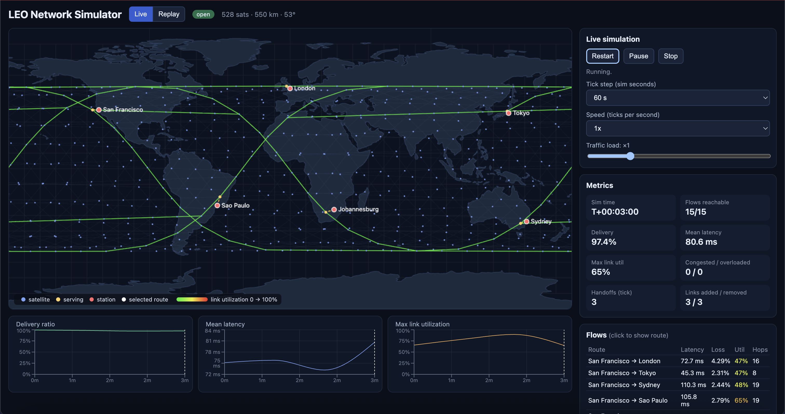
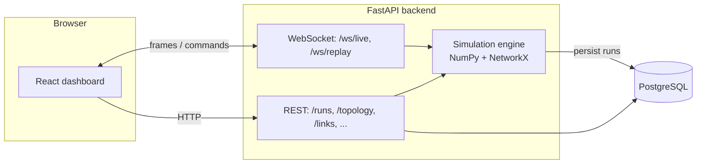

# LEO Network Simulator


A simulator for a LEO satellite constellation **acting as a communications network**, not just a set of orbits. It models inter-satellite and ground links, latency, bandwidth, packet loss, congestion, satellites moving in and out of range, and routing, and shows it all in a live dashboard.



## Features

- **Orbit engine:** Walker Delta constellations on circular orbits, fully vectorized with NumPy (default: 528 satellites at 550 km, 53°)
- **Link model:** +Grid laser inter-satellite links (with range and Earth-occlusion checks), ground links gated by an elevation mask, latency from distance, elevation-dependent ground bandwidth and loss
- **Network graph:** rebuilt every tick with NetworkX, with topology deltas (links appearing and disappearing)
- **Handoff:** each ground station keeps one serving satellite, switching with hysteresis; outages when nothing is visible
- **Traffic and routing:** flows between ground stations are split into chunks and routed with congestion-aware Dijkstra; queueing delay and congestion loss are derived from utilization
- **Persistence:** runs, per-tick metrics, flows, links and handoffs stored in PostgreSQL
- **Live streaming and replay:** WebSockets stream frames in real time, or replay any stored run with seek and speed controls
- **Dashboard:** React + canvas world map, metrics, charts, per-flow route highlighting, and a traffic-load slider that changes congestion while the simulation runs
- **Failure injection:** fail satellites, whole orbital planes, ground stations or inter-satellite links, live or on a schedule, and watch rerouting and recovery
- **Routing policies:** min-hop, shortest-latency, and congestion-aware, plus optional route stickiness (damps route flapping) and configurable handoff hysteresis
- **Experiments:** run several policy arms on identical conditions (failure presets, load, link capacities) and compare goodput, latency, route stability, handoffs and recovery time in charts and a summary table

## Architecture



Per tick: orbit propagation, then link snapshot, then serving-satellite selection, then graph build, then flow routing, then link and flow metrics.

## Quick start (Docker)

```bash
docker compose up --build
```

- Dashboard: http://localhost:8080
- API docs: http://localhost:8000/docs

Press **Start** on the Live tab. Drag the traffic-load slider to push the ground links into congestion, or create a stored run from the Replay tab.

## Local development

Requirements: Python 3.12, Node 20.19+ (or 22.12+), Docker.

```bash
# database
docker compose up -d db

# apply database migrations (once, and again whenever migrations change)
cd backend && alembic upgrade head

# backend
python3.12 -m venv .venv && source .venv/bin/activate
pip install -r backend/requirements.txt
cd backend && uvicorn app.main:app --reload

# frontend (new terminal)
cd frontend && npm install && npm run dev      # http://localhost:5173
```

Tests (the backend tests use in-memory SQLite and need no database):

```bash
cd backend && pytest
```

## Database migrations

The schema is managed with Alembic (`backend/migrations/`). Docker applies migrations automatically on start.

```bash
cd backend
alembic upgrade head                                  # apply migrations
alembic revision --autogenerate -m "describe change"  # after editing app/db/models.py
alembic check                                         # fails if models and migrations differ
```

## API overview

| Endpoint | Description |
|---|---|
| `GET /constellation/info`, `/constellation/positions?t=` | Constellation parameters and satellite positions |
| `GET /links/summary?t=` | Link counts and per-station visibility |
| `GET /topology/summary`, `/topology/delta`, `/topology/graph` | Network graph, routes, and link changes |
| `GET /simulation/run` | Stateless in-memory run |
| `POST /runs`, `GET /runs/{id}/timeline`, `/flows`, `/links`, `/handoffs` | Persisted runs (executed in the background) |
| `WS /ws/live` | Live simulation stream with start, pause, resume, speed, and load controls |
| `WS /ws/replay/{run_id}` | Replay of a stored run with seek and speed controls |
| `POST /experiments`, `GET /experiments/{id}`, `GET /experiments/{id}/timelines` | Policy-comparison experiments: one scenario, several arms, aggregated stats and aligned time series |
| `WS /ws/live` commands `fail`, `recover`, `set` | Inject or recover failures and change policy, stickiness, hysteresis or load while the simulation runs |
| `GET/POST /scenarios`, `GET/PUT/DELETE /scenarios/{id}`, `GET /scenarios/default`, `POST /scenarios/preview` | Saved scenarios (constellation, stations, link parameters) with validation and analytic summaries |

## Model assumptions

- Circular two-body orbits and a spherical Earth, which are fine for network studies but not precise orbit prediction
- ISLs use a "+Grid" topology: 2 intra-plane and 2 cross-plane neighbors per satellite
- Latency is propagation delay plus 0.5 ms per hop plus an M/M/1-style queueing term; ISLs are 10 Gbps and ground links 2 Gbps, scaled down at low elevation
- Links are undirected: both directions share one capacity and one load counter
- Traffic above capacity is dropped (`1 - capacity/load`); a short loss burst is added on freshly handed-off links
- Ground stations never act as transit nodes
- Link loads are *carried* loads: traffic dropped at one link no longer loads downstream links (solved as a damped fixed point)
- `route_changes` counts mid-path route changes only; path changes caused by a ground handoff are tracked separately through the `handoffs` metric
- Each handoff adds a 2% loss burst on the new ground link for one tick, so handoff hysteresis directly affects goodput. Conclusions about the best hysteresis depend on that assumption
- Goodput is delivered / offered traffic, counting unreachable flows as lost

## Project structure

```text
backend/app/
  sim/        orbits, frames, link model, graph, routing, handoff, engine, frame builders
  api/        REST routers and WebSocket endpoints
  db/         SQLAlchemy models, sessions, run persistence
backend/tests/
frontend/src/
  components/ map, charts, controls, panels
  hooks/      WebSocket stream and runs hooks
```

## Roadmap

- Real orbits from TLEs (SGP4) and multiple shells
- Directed full-duplex links and per-satellite capacity limits
- Failure injection (satellite or link outages) and recovery analysis
- Weather-driven rain fade on ground links
- Population-based demand models and user terminals
- Comparing routing policies (shortest-latency vs congestion-aware)
- Alembic migrations